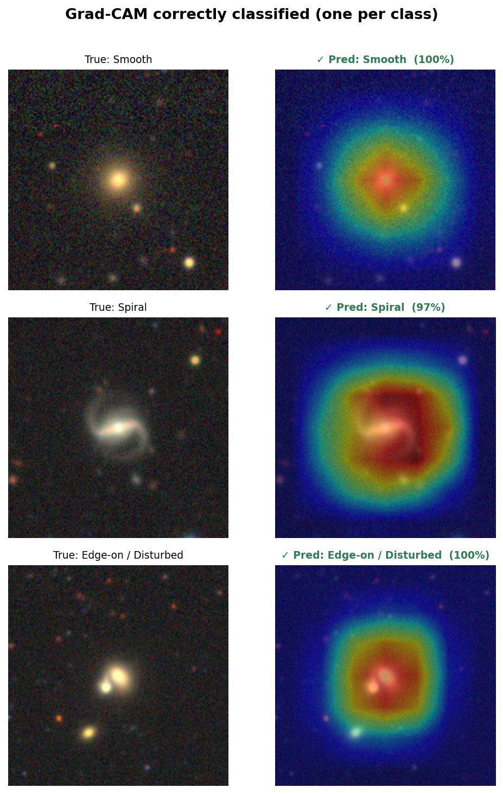

# Galaxy Morphology Classifier

Classifies galaxy morphology from DECam Legacy Survey imaging using a fine-tuned ResNet-18.
Three classes: **Smooth / Elliptical**, **Spiral**, and **Edge-on / Disturbed**.

**[Live demo](https://ashok1103-galaxy-morphology-classifier.hf.space)**

---

## Results

| Model | Parameters | Test Accuracy |
|---|---|---|
| NumPy MLP (from scratch) | 1,082,115 | 75.8% |
| Custom CNN (PyTorch) | 422,179 | 87.8% |
| ResNet-18 fine-tuned | 11,178,051 | **90.0%** |

The custom CNN beats the MLP by 12 points with fewer parameters. The gain comes entirely
from conv layers detecting spatial structure (disk geometry, asymmetry) that a flattened
pixel input cannot capture.

---

## Grad-CAM



The model attends to physically meaningful features. For spiral galaxies it responds to
disk extent and asymmetry rather than just the central bulge. For merging systems it
detects dual nuclei. Misclassified edge-on galaxies show the model attending to the round
brightness envelope of a projected disk, which is geometrically similar to a smooth
elliptical. This is a real astrophysical degeneracy, not a model failure.


---

## Dataset

[Galaxy10 DECals](https://zenodo.org/records/10845026) -- 17,736 images at 256x256 from
the DECam Legacy Survey, originally labelled across 10 morphological classes.

Remapped to 3 classes:

| Class | Original labels | Count |
|---|---|---|
| Smooth / Elliptical | Round smooth, In-between smooth, Cigar smooth | 5,006 |
| Spiral | Barred spiral, Unbarred tight/loose spiral | 6,500 |
| Edge-on / Disturbed | Disturbed, Merging, Edge-on (with/without bulge) | 6,230 |

Split: 70% train / 15% val / 15% test, stratified.

---

## How it works

**Phase 1 - NumPy MLP** (`notebooks/numpy_mlp.ipynb`)

Three-layer network (4096 -> 256 -> 128 -> 3) built from scratch: forward pass, cross-entropy
loss, backpropagation, and mini-batch SGD. No PyTorch, no sklearn neural nets.
Images are flattened 64x64 grayscale arrays.

**Phase 2 - Custom CNN** (`notebooks/cnn_training.ipynb`)

Four conv blocks (Conv -> BatchNorm -> ReLU -> MaxPool) with GlobalAveragePooling and a
two-layer FC head. Trained from scratch on 128x128 RGB images with random flips and
rotation augmentation.

**Phase 3 - ResNet-18 fine-tuning** (`notebooks/cnn_training.ipynb`)

Two-stage fine-tuning: freeze backbone, warm up the new head for 5 epochs, then unfreeze
layer3 and layer4 and train at 3e-4 for 25 epochs. ImageNet normalisation.

**Phase 4 - Grad-CAM** (`notebooks/gradcam.ipynb`)

Gradient-weighted Class Activation Mapping hooked into resnet.layer4. Heatmaps generated
for correct predictions, misclassified examples, and the 6 most confident spiral predictions.

---

## Project structure

```
galaxy-classifier/
├── notebooks/
│   ├── eda.ipynb
│   ├── numpy_mlp.ipynb
│   ├── cnn_training.ipynb
│   └── gradcam.ipynb
├── results/
├── app.py
├── requirements.txt
└── README.md
```

---

## Run locally

```bash
git clone https://github.com/Ashok1103/galaxy-classifier
cd galaxy-classifier
pip install torch torchvision gradio pillow matplotlib scikit-learn h5py seaborn
```

Download [Galaxy10_DECals.h5](https://zenodo.org/records/10845026/files/Galaxy10_DECals.h5)
into a `data/` folder, then run the notebooks in order.

To run the demo locally:

```bash
python app.py
```

---

## Background

The three-class grouping reflects real morphological distinctions in extragalactic astronomy.
Smooth ellipticals have steep de Vaucouleurs brightness profiles and old stellar populations.
Spirals have shallower exponential disk profiles with active star formation in the arms.
Edge-on galaxies are a genuinely hard case. A disk galaxy seen at low inclination projects
onto the sky with a centrally concentrated, roughly elliptical light distribution that looks
similar to a smooth galaxy at this resolution. The confusion matrix reflects this, and the
Grad-CAM heatmaps show the model attending to the bulge rather than any disk structure
in those cases.

---

## Stack

Python, PyTorch, torchvision, NumPy, scikit-learn, Gradio, Hugging Face Spaces, Matplotlib

---

*Ashok Kumar Ramu - Physics & Astronomy, University of Waterloo*
