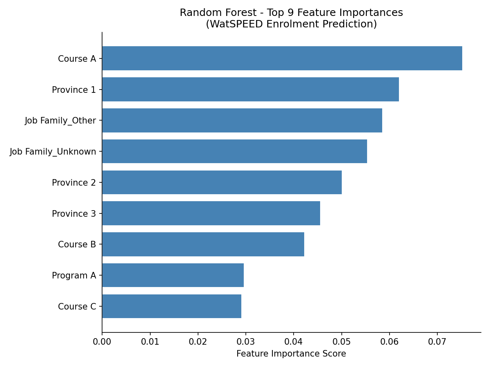
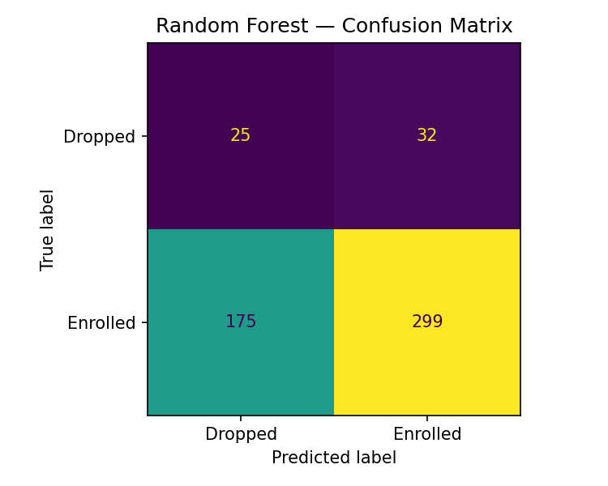
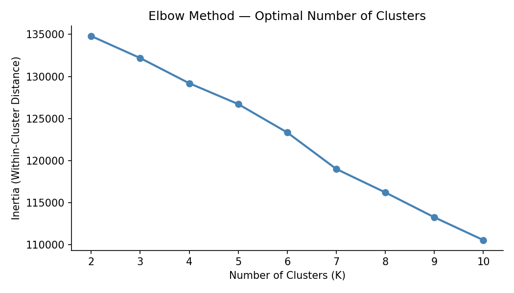

# WatSPEED Enrollment Prediction — ML Portfolio Project

Author: Ashok Kumar Ramu  
Role: Market Research Analyst Co-op — WatSPEED, University of Waterloo  

---

## Overview

WatSPEED is the University of Waterloo's professional development division. This project was completed as a final deliverable during my co-op term.

The goal was to build a machine learning pipeline that predicts whether a learner will remain enrolled or drop out, based on features like course type, geography, and professional background. A secondary analysis used K-Means clustering to identify distinct learner segments.

---

## Project Structure
watspeed-enrollment-ml/
├── data/
│   ├── raw/                        ← original enrollment files (not included)
│   └── processed/                  ← cleaned data (not included)
├── notebooks/
│   ├── 01_data_processing.ipynb    ← LinkedIn ad data processing
│   ├── 02_data_analysis.ipynb      ← EDA and feature engineering (not included)
│   └── 03_ml_model.ipynb           ← model training and evaluation
├── src/
│   ├── preprocess.py               ← data cleaning functions
│   ├── train.py                    ← model training logic
│   └── evaluate.py                 ← evaluation metrics and plots
├── outputs/
│   ├── figures/                    ← saved charts
│   └── models/                     ← saved trained models (not included)
├── requirements.txt
└── README.md

> **Note:** Raw, processed data, 02_data_analysis, models are excluded from this repository due to privacy considerations. The data contains enrollment records from real learners and is the property of WatSPEED, University of Waterloo.

---

## Models

| Model | AUC-ROC | Notes |
|---|---|---|
| Logistic Regression | 0.59 | Baseline |
| Random Forest | 0.54 | Main model |

Both models use `class_weight='balanced'` to handle the ~##/## class imbalance between enrolled and dropped learners.

---

## Feature Engineering

- Merged enrollment data across different programs
- Extracted job family from raw job titles using rule-based parsing (handling 491 unique values)
- Capped job family at top 30 categories, grouping the remainder as `Other` to avoid near-empty dummy columns
- One-hot encoded course title, province, program, and job family

---

## Tech Stack

- Python 3.13
- pandas, numpy
- scikit-learn
- matplotlib
- openpyxl
- joblib

---

## Figures

**Random Forest — Feature Importance**  

**Confusion Matrices**  

**K-Means Elbow Plot**  

